# 🎓 LearnFlow AI — AI-Powered Personalized Learning Platform

<div align="center">

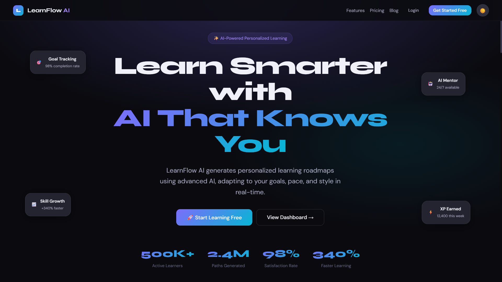

**A fully functional, production-grade EdTech SaaS frontend built as a single HTML file.**

[](.)
[](.)
[](.)
[](.)

</div>

---

## 🚀 Overview

**LearnFlow AI** is a modern, futuristic EdTech SaaS platform that generates personalized AI-powered learning roadmaps. Built as a fully self-contained single HTML file, it includes **17 fully functional pages** with routing, interactive charts, AI chat simulation, gamification, and dark/light theme support.

> Inspired by Notion AI · Duolingo · Coursera · Linear · ChatGPT

---

## ✨ Key Features

| Feature | Description |
|---|---|
| 🤖 **AI Mentor Chat** | ChatGPT-like chat interface with streaming simulation, typing indicators, and smart responses |
| 🗺️ **Learning Path** | Interactive timeline roadmap with expandable modules and progress tracking |
| 📊 **Skill Analytics** | Charts powered by Chart.js — bar, line, radar, doughnut, and activity heatmap |
| 🎮 **Gamification** | XP points, learning streaks, achievements, badges, and leaderboard |
| 🧙 **Onboarding Wizard** | Multi-step wizard with AI loading animation and personalized path generation |
| 🌗 **Dark / Light Mode** | Fully implemented theme switcher with persistent state |
| 📱 **Fully Responsive** | Mobile, tablet, and desktop optimized layouts |
| 🔔 **Notifications** | Notification center with unread indicators and toast alerts |
| 🏢 **Admin & Enterprise** | Admin analytics panel + Enterprise team dashboard |
| 💎 **Pricing Page** | Monthly/yearly billing toggle with animated pricing cards |

---

## 📸 Screenshots

### 🏠 Landing Page
> Animated hero section with floating cards, gradient background, statistics, features, testimonials, FAQ, and footer.


---

### 🔐 Authentication — Sign Up
> Clean two-panel auth layout with social login buttons, form validation UI, and password visibility toggle.

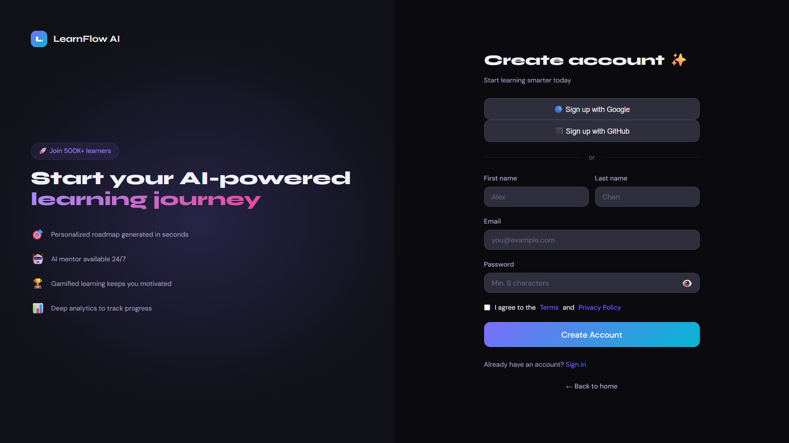

---

### 🎛️ Student Dashboard
> Futuristic dashboard with welcome banner, KPI widgets, weekly progress bar chart, and AI-generated roadmap progress panel.

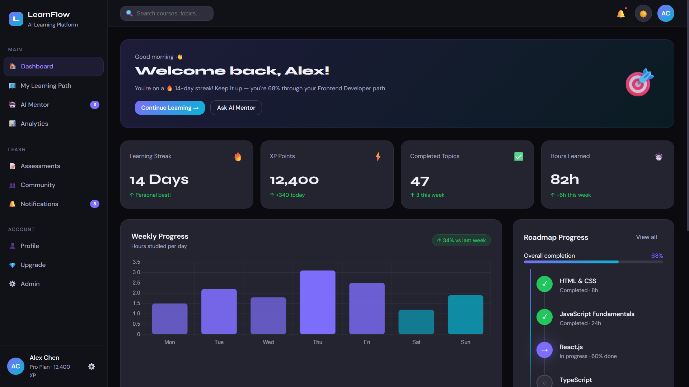

---

### 🗺️ Learning Path
> Interactive timeline roadmap with expandable modules, progress bars, completion indicators, difficulty labels, and resource cards.

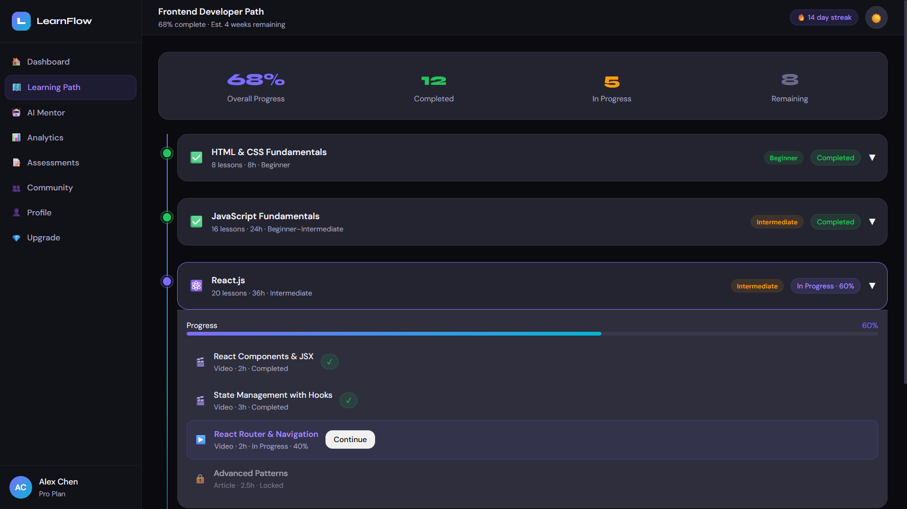

---

### 🤖 AI Mentor Chat
> ChatGPT-style chat interface with conversation history sidebar, typing animations, code block rendering, and smart prompt chips.

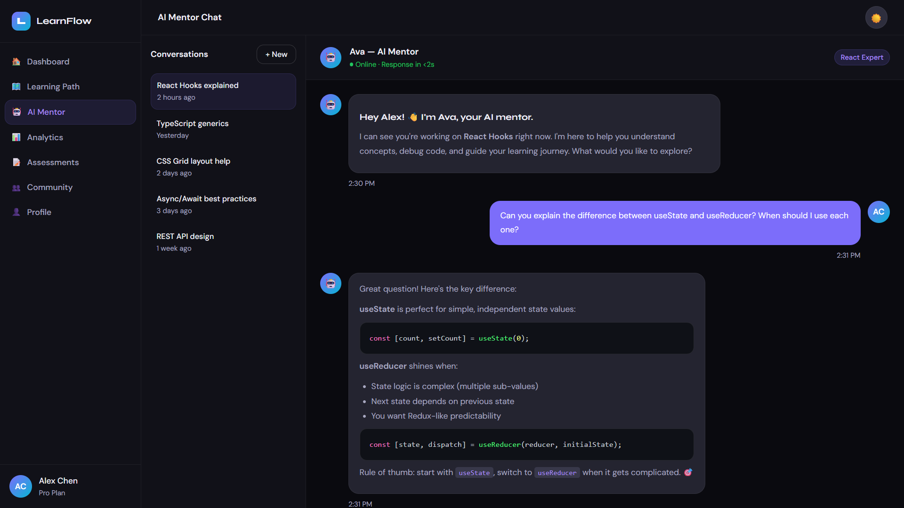

---

### 📊 Skill Analytics Dashboard
> Comprehensive analytics with line chart, radar skill proficiency chart, doughnut completion chart, and activity heatmap grid.

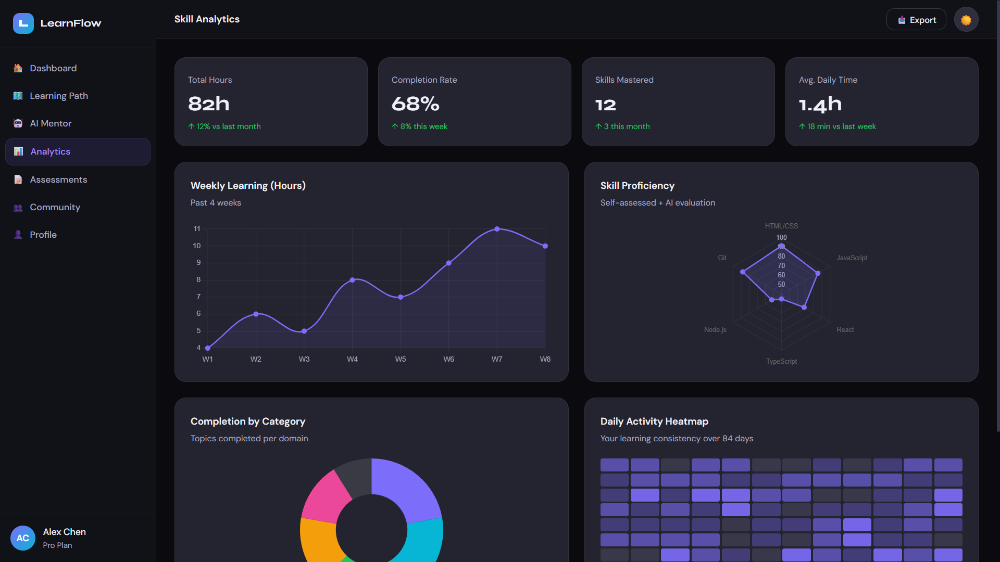

---

### 📝 Assessments
> MCQ quiz interface with timer, progress bar, instant feedback, leaderboard sidebar, and achievement badges.

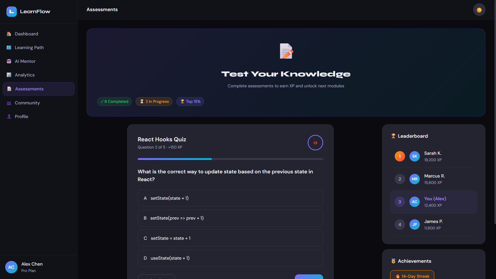

---

### 👥 Community
> Social learning feed with posts, code snippets, trending hashtags, top mentors sidebar, and study groups.

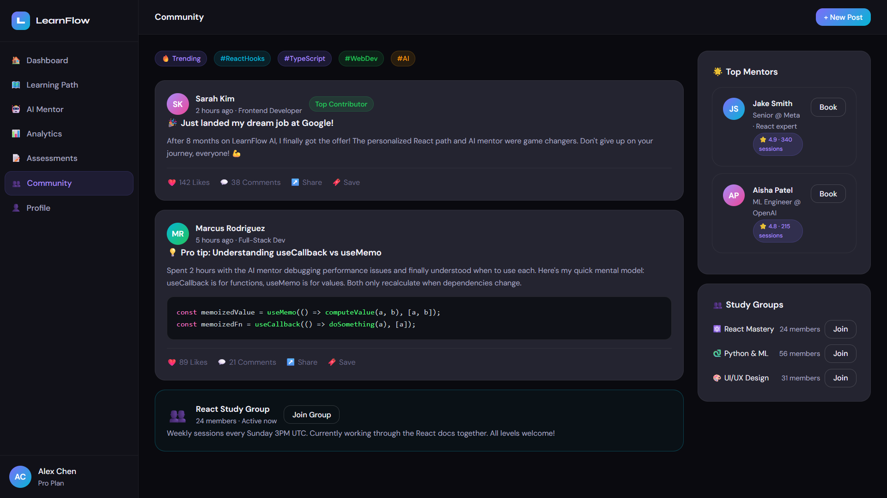

---

### 👤 Profile Settings
> Tabbed profile settings with account details, learning preferences, notification toggles, and security settings.

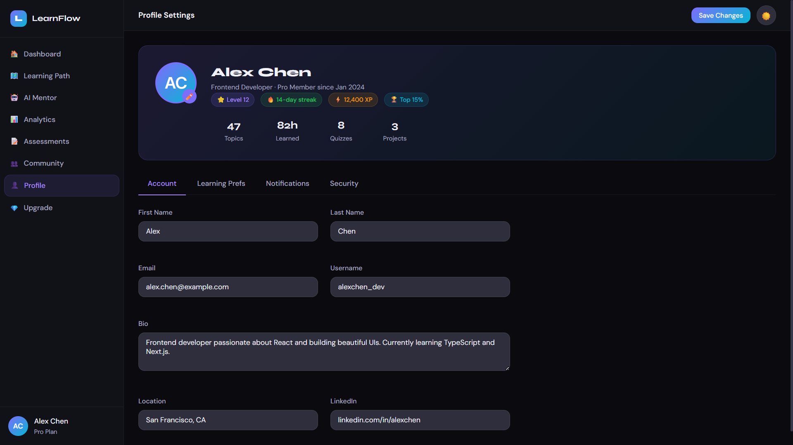

---

### ⚙️ Admin Dashboard
> Admin analytics panel with KPI metrics, revenue growth chart, user acquisition chart, and user management table.

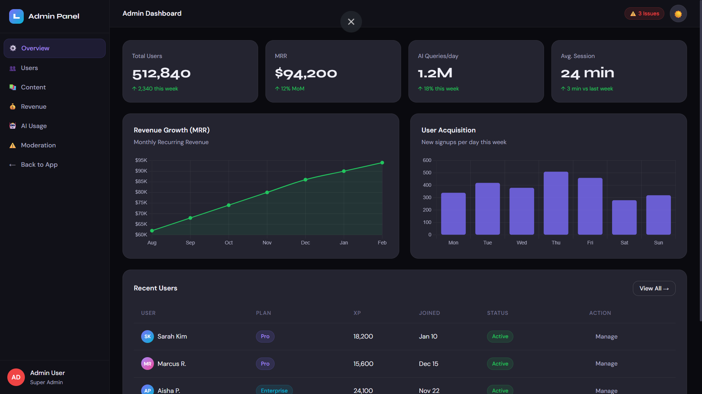

---

### 💎 Pricing & Plans
> Pricing page with monthly/yearly billing toggle, three-tier plan cards, and feature comparison lists.

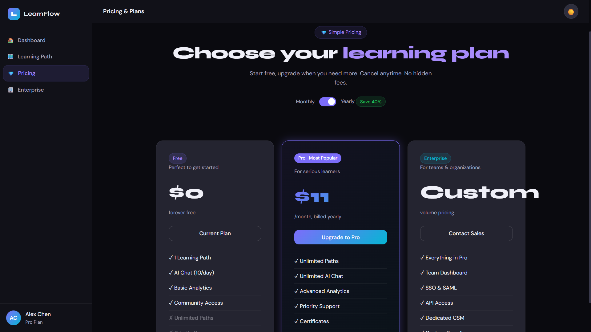

---

## 📄 Pages Included

| # | Page | Route Key |
|---|---|---|
| 1 | 🏠 Landing Page | `landing` |
| 2 | 🔑 Login | `login` |
| 3 | ✨ Sign Up | `signup` |
| 4 | 🔐 Forgot Password | `forgot` |
| 5 | 🧙 Onboarding Wizard | `onboarding` |
| 6 | 🎛️ Student Dashboard | `dashboard` |
| 7 | 🗺️ Learning Path | `learning-path` |
| 8 | 🤖 AI Mentor Chat | `chat` |
| 9 | 📊 Skill Analytics | `analytics` |
| 10 | 📝 Assessments | `assessments` |
| 11 | 👥 Community | `community` |
| 12 | 👤 Profile Settings | `profile` |
| 13 | 💎 Pricing | `pricing` |
| 14 | 🔔 Notifications | `notifications` |
| 15 | ⚙️ Admin Dashboard | `admin` |
| 16 | 🏢 Enterprise Dashboard | `enterprise` |
| 17 | ❌ 404 Page | `404` |

---

## 🛠️ Tech Stack

This project is built as a **single self-contained HTML file** — no build tools, no npm, no dependencies to install.

```
learnflow-ai.html
├── HTML5 — Semantic structure & SPA routing
├── CSS3 — Custom design system with CSS variables
│   ├── Glassmorphism effects
│   ├── Gradient backgrounds & highlights
│   ├── Smooth animations & transitions
│   ├── Responsive grid layouts
│   └── Dark / Light theme system
├── Vanilla JavaScript — All interactivity
│   ├── Client-side SPA routing
│   ├── Chat simulation with typing indicators
│   ├── Onboarding wizard with AI loading
│   ├── Quiz interaction logic
│   ├── Toast notification system
│   └── Theme persistence
└── Chart.js (CDN) — All data visualizations
    ├── Bar charts (Weekly Progress, User Acquisition)
    ├── Line charts (Learning Trends, Revenue MRR)
    ├── Radar chart (Skill Proficiency)
    ├── Doughnut chart (Completion by Category)
    └── Custom Heatmap (Activity Grid)
```

**Fonts loaded from Google Fonts:**
- `Syne` — Display / Headings
- `DM Sans` — Body / UI text

---

## 🎨 Design System

### Color Palette (Dark Mode)
| Token | Value | Usage |
|---|---|---|
| `--bg` | `#0a0a0f` | Page background |
| `--bg2` | `#111118` | Sidebar / navbar |
| `--surf` | `#242430` | Card surfaces |
| `--accent` | `#7c6dfa` | Primary accent (purple) |
| `--accent2` | `#a78bfa` | Secondary accent |
| `--cyan` | `#06b6d4` | Gradient partner |
| `--green` | `#22c55e` | Success / completed |
| `--amber` | `#f59e0b` | Warning / streak |
| `--red` | `#ef4444` | Error / danger |
| `--pink` | `#ec4899` | Decorative accent |

### Gradients
```css
--grad:  linear-gradient(135deg, #7c6dfa, #06b6d4);  /* Primary */
--grad2: linear-gradient(135deg, #a78bfa, #ec4899);  /* Secondary */
```

### Typography
| Role | Font | Weight |
|---|---|---|
| Headings / Display | Syne | 700–800 |
| Body / UI | DM Sans | 300–600 |

---

## ⚡ Getting Started

### Option 1 — Open directly in browser
```bash
# Just double-click the file, or:
open learnflow-ai.html
```

### Option 2 — Serve locally
```bash
# Python
python -m http.server 8080

# Node.js (npx)
npx serve .

# Then open: http://localhost:8080/learnflow-ai.html
```

### Option 3 — Deploy to static hosting
Drop `learnflow-ai.html` into any static hosting service:
- [Vercel](https://vercel.com) · [Netlify](https://netlify.com) · [GitHub Pages](https://pages.github.com) · [Cloudflare Pages](https://pages.cloudflare.com)

> **No build step required.** The file is completely self-contained.

---

## 🎮 Interactive Features

### 🌗 Theme Toggle
Click the **☀️ / 🌙** button in any topbar or navbar to switch between dark and light mode.

### 🧭 Navigation
All pages are linked via JavaScript routing. Use the sidebar nav items, buttons, and links to move between pages. No browser navigation needed.

### 🤖 AI Chat
1. Navigate to **AI Mentor** from the sidebar
2. Type a message or click a **prompt chip**
3. Press `Enter` or click **Send ↑**
4. Watch Ava (AI mentor) respond with a typing animation

### 📝 Quiz
1. Navigate to **Assessments**
2. Click any answer option (A–D)
3. See instant correct/wrong feedback with color highlights
4. A toast notification confirms your answer

### 🧙 Onboarding
1. Navigate to **Sign Up** and click **Create Account**
2. Walk through the 5-step preference wizard
3. Click **Generate My Path ✨** on the final step
4. Watch the AI loading animation with progress bar
5. Auto-redirects to the **Dashboard**

### ⌨️ Keyboard Shortcuts
| Shortcut | Action |
|---|---|
| `Ctrl/Cmd + K` | Command palette (demo) |
| `Enter` in chat | Send message |

---

## 📦 Project Structure (Conceptual)

While delivered as a single HTML file, the code is organized in logical sections matching a real Next.js project structure:

```
learnflow-ai.html
│
├── <style>                    → /styles/globals.css
│   ├── CSS Variables          → Design tokens / theme
│   ├── Utility Classes        → Tailwind-like helpers
│   ├── Component Styles       → Buttons, Cards, Inputs...
│   └── Page-specific Styles   → Landing, Auth, Dashboard...
│
├── Pages (HTML sections)      → /app/*
│   ├── #page-landing          → /app/page.tsx
│   ├── #page-login            → /app/login/page.tsx
│   ├── #page-signup           → /app/signup/page.tsx
│   ├── #page-forgot           → /app/forgot-password/page.tsx
│   ├── #page-onboarding       → /app/onboarding/page.tsx
│   ├── #page-dashboard        → /app/dashboard/page.tsx
│   ├── #page-learning-path    → /app/learning-path/page.tsx
│   ├── #page-chat             → /app/chat/page.tsx
│   ├── #page-analytics        → /app/analytics/page.tsx
│   ├── #page-assessments      → /app/assessments/page.tsx
│   ├── #page-community        → /app/community/page.tsx
│   ├── #page-profile          → /app/profile/page.tsx
│   ├── #page-pricing          → /app/pricing/page.tsx
│   ├── #page-notifications    → /app/notifications/page.tsx
│   ├── #page-admin            → /app/admin/page.tsx
│   ├── #page-enterprise       → /app/enterprise/page.tsx
│   └── #page-404              → /app/not-found.tsx
│
└── <script>                   → /store, /hooks, /utils
    ├── navigate()             → Router
    ├── toggleTheme()          → Theme store (Zustand equiv.)
    ├── showToast()            → Toast notifications
    ├── sendChatMsg()          → Chat state
    ├── obNext() / obBack()    → Onboarding wizard state
    ├── initDashboardCharts()  → React Query + Recharts equiv.
    ├── initAnalyticsCharts()  → Chart.js renders
    ├── selectQuiz()           → Assessment logic
    └── updatePricing()        → Pricing toggle state
```

---

## 🔌 Extending to Full Stack

This frontend is production-ready to be wired up to a real backend. Replace the mock data and simulated responses with:

| Frontend Mock | Real Backend |
|---|---|
| `aiResponses[]` array | Anthropic / OpenAI API streaming |
| Hardcoded dashboard data | REST API / GraphQL endpoints |
| `navigate()` router | Next.js App Router |
| Inline CSS variables | Tailwind CSS + shadcn/ui |
| Chart.js | Recharts |
| Local JS state | Zustand + React Query |
| Toast function | react-hot-toast / sonner |

### Suggested Backend Stack
```
Next.js 15 (App Router)
├── Prisma + PostgreSQL     — User & learning data
├── Clerk / NextAuth        — Authentication
├── OpenAI / Anthropic API  — AI Mentor chat
├── Stripe                  — Payments & subscriptions
├── Vercel                  — Deployment
└── Upstash Redis           — Session & caching
```

---

## 📋 Component Inventory

### Reusable UI Components
- `btn`, `btn-primary`, `btn-grad`, `btn-outline`, `btn-ghost`, `btn-sm`, `btn-lg`, `btn-icon`
- `card`, `card-sm`, `card-grad`
- `badge`, `badge-accent`, `badge-green`, `badge-amber`, `badge-red`, `badge-cyan`
- `avatar`
- `input`, `form-group`, `label.lbl`
- `progress-bar`, `progress-fill`
- `toggle-track`, `toggle-knob`
- `nav-item`, `sidebar`, `topbar`
- `toast-item` (via `showToast()`)
- `skeleton` (shimmer loading)
- `code-block`
- `tabs`, `tab`

### Page-Level Components
- `welcome-banner` — Dashboard greeting card
- `widget-grid` + `widget` — KPI metric cards
- `roadmap-node` — Timeline node with connectors
- `path-module` + `module-header` + `module-body` — Expandable learning modules
- `rec-card` — AI recommendation cards
- `quiz-option` — Interactive MCQ options
- `leaderboard-item` — Ranked user rows
- `post-card` + `post-actions` — Community feed posts
- `mentor-card` — Expert mentor profiles
- `notif-item` — Notification list items
- `data-table` — Admin user management table
- `team-card` + `org-chart` — Enterprise org view
- `ai-insight` — AI recommendation callout box
- `heatmap` + `heat-cell` — Activity heatmap grid
- `floating-card` — Animated landing page cards
- `convo-item` — Chat conversation list
- `prompt-chip` — Suggested chat prompts

---

## 🙌 Credits

Built with ❤️ using:
- [Chart.js](https://www.chartjs.org/) — Data visualizations
- [Google Fonts — Syne & DM Sans](https://fonts.google.com/) — Typography
- Inspired by [Notion](https://notion.so), [Linear](https://linear.app), [Vercel](https://vercel.com), [Duolingo](https://duolingo.com)

---

## 📄 License

MIT License — Free to use, modify, and distribute.

---

<div align="center">
  <strong>⭐ Star this repo if you found it useful!</strong><br/>
  Built as a reference implementation for AI-powered EdTech SaaS frontends.
</div>
